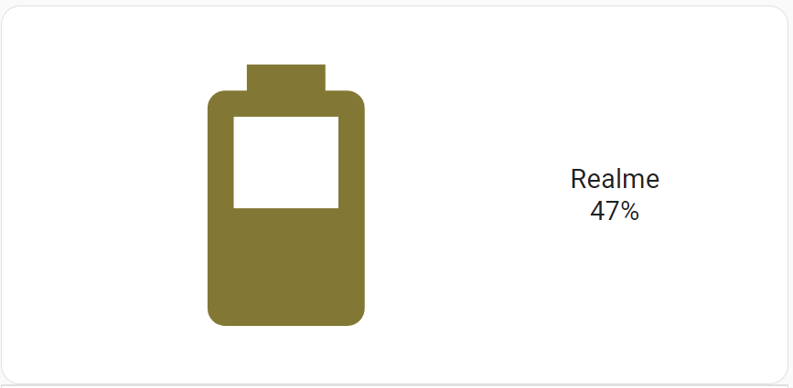
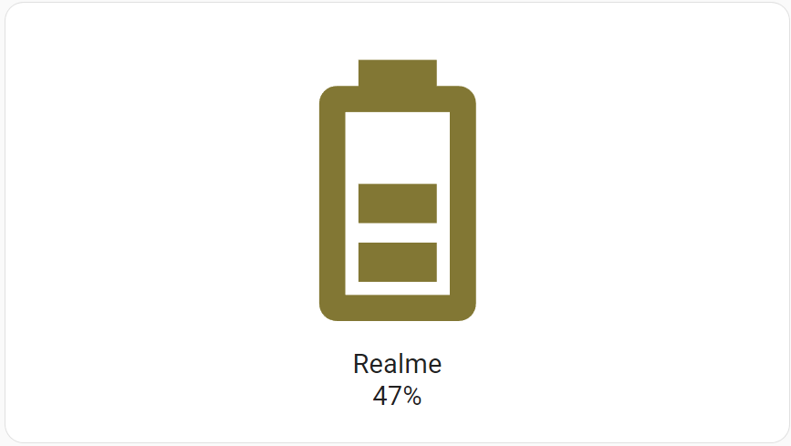
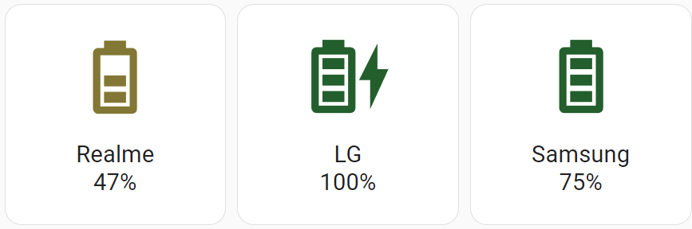

# jb-battery-card

Home Assistant Batter Card

| Horizontal                         | Vertical with variant=simple   |
|------------------------------------|--------------------------------|
|  |  | 

## Several devices in a grid



## Config

| Name       | Type   | Default | Description                                                                            |
|------------|--------|---------|----------------------------------------------------------------------------------------|
| type       | string |         | custom:jb-battery-card                                                                 |
| entity     | string |         | your entity id                                                                         |
| title      | string |         | your device name                                                                       |
| horizontal | bool   | false   | (optional) enable horizontal card layout                                               |
| variant    | string |         | (optional) icons variant. At this moment can be set only to "simple" or not set at all |
| colors     | object |         | (optional) color config for battery level                                              |

## Example

```yaml
type: custom:jb-battery-card
entity: sensor.rmx3085_battery_level_2
title: Realme
horizontal: false
variant: simple
colors:
  '0': '#bf360c'
  '15': '#ad6b0d'
  '33': '#827717'
  '66': '#1b5e20'
```

## How `colors` works here?

Card itsef provides nice colors depends on battery level. But you can override it with your own colors. Looking on the example above:

- from `0` to `14` `#bf360c` will be used
- from `15` to `32` `#ad6b0d` will be used
- from `33` to `65` `#827717` will be used
- from `66` to `100` `#1b5e20` will be used

Of course, you can specify additional colors for other levels.

### Disable batttery level colors

If you do not want to set colors depends on battery level, just set only one entry in `colors` property like that:

```yaml
...
colors:
  '0': '#999999'
```

This way battery icon will always be gray no matter what is the battery level.
